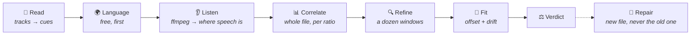

<div align="center">

# 💬 Cicerone

**A Jellyfin plugin that listens to your films —<br/>and tells you whether the subtitles are actually saying what they say.**

[](https://jellyfin.org)
[](https://dotnet.microsoft.com)
[](#-installation)

*The right language · the right cut · timed to the dialogue*

</div>

---

Cicerone is a scheduled task. For every item it reads the audio for where somebody is speaking, slides the subtitle track over that pattern until the two agree, and reports the difference — the constant offset, the drift, and how far out a viewer would actually be at the worst point.

It answers the question nothing else in a media server asks: not *are there subtitles*, but *are these the right ones, and are they in time*.

**It costs nothing to do that.** Sync is a question about *when* somebody spoke, and answering it does not require knowing *what* they said — so it needs no model, no network call and no bill, and it reads the whole file rather than a few sampled windows. A speech-to-text model is needed for exactly one job now: **writing** a subtitle track for something that has none.

> **Status:** written against Jellyfin 10.11.11. Everything described here is built and the pure logic is covered by tests, but **the plugin has not yet been run against a live server** — see [Status](#%EF%B8%8F-status) before installing.

## 🎯 Scope

Cicerone **grades, repairs and manages the subtitles you have** — and will write one by listening to the film when there is nothing there to grade.

It does not *download* them. [Bazarr](https://www.bazarr.media/) and the Open Subtitles plugin fetch from subtitle sites; this tells you whether what they fetched is any good, and can produce a track from the audio itself when nothing can be fetched. It is also not a rules engine — [SmartLists](https://github.com/jyourstone/jellyfin-smartlists-plugin) is that — and **it never overwrites a file it did not write.**

## 🧠 How it works



**1. Read.** Every subtitle track in a language you asked for, pulled as SRT through Jellyfin's own `ISubtitleEncoder` — which converts ASS, mov_text, WebVTT and external files on the way out, so Cicerone parses exactly one format. Annotations, speaker names, `[door creaks]` and the ripper's signature are stripped, because a transcript will never contain any of them and a hearing-impaired track would otherwise score worse than a clean one against identical audio.

**2. Language.** Read from the track's own text, before a byte of audio is fetched. Script decides where it can — text in Hangul is Korean and no word list is going to argue — and within the Latin and Cyrillic alphabets the signal is function words: *the*, *und*, *que*, *ale*. They are the most frequent words in any language and almost never shared across two.

This is the cheapest useful thing here and it runs first for a reason. **A track tagged English and written in Spanish is a common and completely invisible fault** — the player shows the language you picked, the words are wrong, and no amount of sync checking explains it. Asking a model would cost a call per track to answer the one question in the plugin that a few hundred bytes of table answers exactly.

**3. Listen.** ffmpeg — the server's own, at below-normal priority — decodes the audio track once and reports every stretch that is not silence. Two filters run in front of the detector: a high-pass at 200 Hz and a low-pass at 3 kHz, roughly the band a voice occupies. Without them a film's score and its explosions register as activity exactly like a voice does, and the signal stops being about dialogue at all.

**Which audio track matters.** A release carrying a German dub as its default, checked against an English subtitle file, is still the same timeline — but Cicerone picks the audio track in the subtitle's own language anyway, then the default, then the one with the most channels, because a stereo commentary beside a 5.1 feature mix is words spoken *over* the film rather than in it, and its pauses are in different places.

**4. Correlate.** Both sides now reduce to the same shape: a row of bins saying *somebody is speaking here*. The audio gives one; the subtitle file gives the other, because a cue is a claim that somebody is talking from its start to its end. Slide one over the other and the position where they agree is the offset.

> **This is correlation, not counting.** Two signals that are each speech half the time agree half the time *at every position*, so a raw agreement count is a large number that barely moves and its peak is noise. Subtracting each signal's mean measures agreement above what chance already provides — which peaks sharply, and only in the right place.

The whole file is tried against each known frame-rate ratio, and the one that agrees best wins. That matters for more than naming the fault: **a PAL-drifting file drifts twenty-five seconds inside a ten-minute window**, so its peak in any one window is smeared across half a minute and there is nothing sharp left to find. Taking the ratio out first is what makes the next step possible.

**5. Refine.** A dozen windows across the runtime, each correlated again at fifty-times finer resolution over a few seconds either side of what the whole-file answer predicts. Each returns one measurement: *this is how far out the track is, here*.

**These windows are free, and that changes what is affordable.** Under a transcript the count was a compromise between seeing the drift and paying for it; here it is only arithmetic, so there are twelve rather than five and the line survives several of them landing in a silence.

**How much a window's answer is worth** is read off the correlation coefficient, which is absolute: speech aligned against the subtitles describing it scores around 0.7, and two stretches that merely both contain talking score around 0.04. A window that cannot beat the floor is dropped rather than allowed to tilt the line.

**6. Fit.** A straight line through the anchors, weighted by confidence, giving a constant offset **and a drift**. The residual is reported alongside, because it is the fit's own account of whether a line was the right thing to fit at all.

**7. Verdict.** In sync, out by a constant, drifting, the wrong language, or not this dialogue at all.

A track that agrees with the audio at *no* position anywhere is the one that was written for something else. Under the old method that came back as "words in common with nothing"; it is the same conclusion, now reached over the whole file rather than over five sampled windows.

## 🎞 Why one measurement is worse than none

The most common way a subtitle file is wrong is not an offset. It is a **frame rate mismatch**: a file timed against a 25 fps PAL transfer, played over a 23.976 fps source. It drifts at one part in twenty-four — dead on at one moment, four minutes adrift a couple of hours later.

Anyone who has nudged a subtitle offset until the opening scene matched, and found it broken again an hour into the film, has met this.

Now consider what a checker that measures sync **at one point** reports about such a file. It picks a moment, measures, and finds the subtitles perfect — because at that moment they *are* perfect. It tells you the file is fine. You believe it, because you asked and it checked.

That is worse than not checking at all.

```
        error
          │
    +25s ─┤ ●
          │   ●
      0s ─┼─────●───────────────────  ← the one place a single check might look
          │       ●
    −25s ─┤         ●
          │           ●
   −200s ─┤             ● ● ● ● ● ● ●
          └──────────────────────────
          0                    runtime
```

Two measurements is the minimum that can see a slope at all. A dozen is what makes the answer survive several of them landing in a silence or a music cue. That is the whole premise of the plugin, and it is why the window count is a setting with a floor rather than a dial you can turn to one.

This is also the part the change of method made strictly better. Under a transcript, every extra measurement was another two minutes on the bill, so five was a compromise between seeing the drift and paying to see it. A correlation over speech activity costs the same whether it is read in five places or fifty, so the compromise is gone.

**Naming the ratio matters too.** A fitted drift of 1.04270 is a measurement with error in it; 25/23.976 is exact. When the fit lands within a whisker of a known frame rate pair, Cicerone snaps to the ratio — which makes a repair correct across the whole runtime instead of accumulating the fit's own residual over three hours, and lets the report say *25 → 23.976 fps, so the file was timed against a different transfer* rather than printing a slope at you.

The tolerance is tight enough to tell 24 from 23.976, which differ by one part in a thousand and two and a half seconds across a feature.

## 🌍 Choosing a language

**Languages you want, best first** is the setting the whole plugin is arranged around. It decides which tracks are worth checking, which audio track each one is measured against, which language an item is reported as *missing* — and therefore which language gets transcribed if you ask for that.

Leave it empty and every track gets checked, which on a disc rip with sixteen language tracks is fifteen answers nobody wanted.

Where an item has several tracks in one language, Cicerone ranks them and the report shows the winner:

| Rank by | Then | Reason |
|---|---|---|
| **Verdict** | In sync → offset → drifting → unknown → mismatched | The whole point of having checked is that a verified track should win |
| **Cue count** | More is better | A fuller track over a partial one |
| **Not hearing-impaired** | Clean before SDH | Annotations are not dialogue |
| **Embedded** | Before external | See below |

That last row inverts what a plugin merely *reading* subtitles would do. An embedded track was timed against the encode it ships inside; an external file was timed against whatever release its author happened to have — **which is the single largest source of the desync this plugin exists to find.**

## ⚙️ The model

Cicerone keeps a list of transcription profiles rather than one set of credentials. A profile is everything needed to call one backend — provider, model, its own key, an optional base URL, and its own price.

| Provider | Notes |
|---|---|
| **OpenAI** | `whisper-1`. See below for why not the newer ones |
| **OpenAI-compatible** | Anything speaking the same endpoint at a base URL you supply — Speaches, faster-whisper-server, whisper.cpp's server, LM Studio, Groq. **A local one makes the whole plugin free and sends no audio anywhere** |
| **Google** | Gemini takes audio as an ordinary part of a prompt, and the response schema makes the shape an API guarantee rather than something the prompt asks for |

> **Cicerone needs a *timed* transcript, not a good one.** The entire output is a comparison between when a word was said and when the subtitle claims it was, so timings are the product and the prose is incidental.
>
> That rules out more models than it sounds like it should. Segment timings come back only in OpenAI's `verbose_json` response format, and **`gpt-4o-transcribe` and its mini do not support that format at all** — they return an excellent transcript with no times in it and are useless here. The old, cheap `whisper-1` is the correct choice, which is a pleasant place to end up.
>
> A transcript that arrives untimed is still kept: its words are spread evenly across the clip, its confidence is halved, and the report says the timings were estimated rather than heard. Spread like that it can still prove a track is a minute late; it can never resolve the third of a second that separates *in sync* from *not*.

Prices are per **minute of audio** rather than per token, because minutes are the unit Cicerone actually controls.

**None of this is needed to check sync.** A profile is required for two things only: transcribing an item that has no track at all, and the transcript sync method if you deliberately turn it on. Leave both alone and Cicerone never makes a network call — **Work it out** on the Run tab will quote a whole library at nothing, which is the arithmetic and not a rounding.

## 🔧 Repairs

**Cicerone never edits a subtitle file.** A correction is a measurement, measurements have error, and the failure mode of editing in place is destroying a file somebody spent an evening timing by hand.

A repair is always a new file beside the original:

```
Film (2019).mkv
Film (2019).en.srt              ← yours, untouched
Film (2019).en.cicerone.srt     ← the corrected copy
```

Jellyfin reads the language out of that name and offers it as a selectable track. The `cicerone` marker is what makes the plugin's own output identifiable — **nothing here will ever overwrite a file it did not write** — and it is never allowed to be empty. A hearing-impaired source keeps its `sdh` flag, or a repaired SDH track would appear as a second, mysteriously duplicated language in the viewer's menu.

Only the timings change. Cues are rewritten from the original text, so italics, annotations and speaker names come through a repair byte-identical. The file is written to a temporary name and moved into place, because a run *will* be interrupted — installing any plugin tears Jellyfin's host down in process — and half a subtitle file is something a player will happily load and then truncate the film at.

| Setting | Description |
|---|---|
| **When a track is out of sync** | Report only *(default)*, write a corrected copy, or write it and rescan so Jellyfin picks it up. Look at what a first run finds before letting it write anything — a library where everything reads as mismatched usually means a misconfigured transcriber, not two hundred broken files |
| **Only repair beyond** | 0.6s, deliberately above the in-sync tolerance. Between the two sits a band where rewriting would move the timings by less than the measurement's own error, which is not a repair — it is a coin toss that leaves a second file in the folder |
| **Only repair above confidence** | Averaged over the windows that actually matched, and at least two of them. A window that produced nothing is silence rather than disagreement, and letting it drag the average down would block repairs on quiet films |
| **Write beside the media** | The only place Jellyfin will pick a subtitle up from. Read-only folders fall back to the plugin's data directory and the report says so, because a repair nothing can see is not the same as a repair |

Clearing the stored reports does **not** delete repaired files. Those are files in your library folders, and removing them is a decision to make with a file manager rather than a side effect of clearing a cache.

## 🗂 The subtitle manager

Everything one item has by way of subtitles, in one place — the tracks inside the container, the sidecars beside it, and anything Cicerone has written itself. Search for a film or paste an item id, and the Subtitles tab lists all of them with their language, where they came from, their size and the last verdict Cicerone reached about them.

| | |
|---|---|
| **Save a copy** | Pulls an embedded track out to an SRT file beside the film. This is what makes everything else available for it: a stream inside a container cannot be retimed or removed without rewriting the film, which Cicerone will not do. |
| **Edit the timing** | A shift in seconds and a speed factor, applied through exactly the same retiming an automated repair uses. The frame-rate ratios are offered as buttons, because a drifting file needs one of about six numbers and nobody remembers that 23.976/25 is 0.95904. |
| **Edit the text** | The whole track as SRT, read through the server's own subtitle encoder — the same route Cicerone measures through, so what you see is exactly what it saw. |
| **Delete** | Removes a subtitle file. It asks twice, and the second press is a different button to look at. |

**Two rules govern all of it, and they are not the same rule.**

The first: **Cicerone never overwrites a file it did not write.** Editing somebody else's track saves a corrected copy and leaves the original where it is; editing one of Cicerone's own writes over it, because putting that back costs a re-run. Everything the plugin produces carries a marker in its name — `Film.en.cicerone.srt` for a repair, `Film.en.cicerone-heard.srt` for one it transcribed — and that marker is how ownership is decided.

The second: **you may delete anything.** That is not a contradiction. The first rule is about what the plugin does on its own initiative; a manager exists precisely so somebody can look at the six subtitle files that have accumulated beside a film and remove four of them. Refusing that would not be caution — it would be making you open a file manager to do the same thing with less information in front of you.

Every action names a track by an opaque id, and the server looks that id up against a freshly built listing of that item's subtitles before touching anything. An endpoint that accepted a path would accept *any* path, and this one runs as an administrator.

## ✍️ Writing a track that isn't there

When an item has no readable track in a language you asked for — and an image track or a forced one does not count, since neither can be read — Cicerone will write one by listening to the whole film.

This is the **only** thing left that costs money, and it is off by default. The arithmetic is the reverse of everything else here: a check is free, and a transcription is a whole runtime of audio sent to your transcriber a piece at a time. On a local whisper server that is free and slow; on a hosted one it is billed per minute of audio, and the manager says so before you press the button.

A transcript is not subtitles, so what comes back is re-cut before it is written: long utterances split at sentence ends, then at clause commas, then on word boundaries; fragments of one breath joined; nothing on screen for more than seven seconds or less than one; two lines of about forty-two characters, broken near the middle. It is written to a new file marked as Cicerone's own and never over anything that was already there.

Run it per item from the Subtitles tab, or turn it on for a whole run — bounded by the audio budget, which exists for exactly this.

## 📊 The report

**Cicerone → Report** tallies what has been found, counted on the **best** track per language rather than on every track — that is the one a viewer will actually be shown. An item holding one perfect English track and three broken ones is covered; tallying all four would report it as a quarter working.

| Verdict | What it means | Repairable |
|---|---|---|
| **In sync** | Matches the dialogue and holds its timing throughout | — |
| **Out by a constant** | The whole track is shifted, evenly | Yes |
| **Drifting** | Runs at the wrong speed: right in one place, wrong in another | Yes |
| **Not this dialogue** | The windows each measured something real and lie on no single line — a different cut, the wrong file, or audio the transcriber could not read | No |
| **Wrong language** | The text is confidently not the language the track claims | No |
| **Nothing to check** | Forced, image-only, or no dialogue once annotations came off | No |
| **Undecided** | Nothing was listened to, or nothing came back | No |

The number worth watching is **worst error**, not the offset. A drifting track has an offset near zero and is unwatchable by the end; reporting the offset would say it is fine.

Language beats sync in the ordering, because a Spanish file tagged English is not a sync problem and reporting it as one sends you off to fix the wrong thing. It is also the one verdict reached without spending anything.

Reports are keyed on the media file's size and modification time, so a second run over an unchanged library is free and a replaced release is re-checked without anybody having to remember that it was replaced.

## 📦 Installation

### Prerequisites

1. A Jellyfin **10.11.x** server.
2. **ffmpeg**, which Jellyfin already ships and configures — Cicerone uses the server's own path, so if playback works, this does too.
3. A speech-to-text endpoint: an OpenAI key, a Google key, **or** a local Whisper server, which costs nothing and sends no audio off your network.

### Install from the plugin catalogue

1. In Jellyfin, go to **Dashboard → Plugins → Repositories** and add:

   ```
   https://raw.githubusercontent.com/nitramivel/jellyfin-cicerone/main/manifest.json
   ```

2. Switch to the **Catalog** tab — Cicerone appears under General. Click it and press **Install**.
3. Restart Jellyfin when prompted.
4. Open Cicerone's configuration page. On the **Models** tab add a profile and press **Test the default profile** — it sends half a second of silence, which costs nothing and answers the question the page otherwise cannot: without it, a wrong key, a local server that is not running, and a library with nothing to check all look identical.
5. On **Languages**, set the languages you actually want.
6. On **Run**, press **Work it out** to see what a full run would cost, then **Try one item** with a single item ID before turning it loose.

The **Verify Subtitles** scheduled task ships with **no default schedule**. Every other task in this family runs weekly out of the box; this one does not, because it is the only one that spends money the first time it fires. Set a schedule under **Dashboard → Scheduled Tasks** once the bill is a known quantity.

### Install manually (folder drop)

1. Grab a packaged build from [releases](https://github.com/nitramivel/jellyfin-cicerone/releases), or build one yourself. Either way you end up with a folder containing `Jellyfin.Plugin.Cicerone.dll` and `meta.json`.
2. Copy it into your server's plugin directory as `plugins/Cicerone_<version>`:

   | Setup | Plugin directory |
   |---|---|
   | Podman/Docker (config dir mounted at `/config`) | `<your config mount>/plugins/Cicerone_0.1.0.0/` |
   | Linux package | `/var/lib/jellyfin/plugins/Cicerone_0.1.0.0/` |
   | Windows | `%ProgramData%\Jellyfin\Server\plugins\Cicerone_0.1.0.0\` |

3. Make sure the files are readable by the Jellyfin user (for containers, match the UID the container runs as).
4. Restart Jellyfin, then configure as above.

### Building from source

Requires the .NET 9 SDK.

```bash
git clone https://github.com/nitramivel/jellyfin-cicerone
cd jellyfin-cicerone
dotnet test Jellyfin.Plugin.Cicerone.sln -c Release   # no network, no ffmpeg needed
./build/package.sh                                    # artifacts/Cicerone_<version>/
```

`build/package.sh` accepts `VERSION` and `TARGET_ABI`. Releasing a catalogue version is `VERSION=x.y.z.w CHANGELOG="..." ./build/release.sh`, which builds the zip, computes its checksum and updates `manifest.json` — then upload that exact zip to a GitHub release tagged `vx.y.z.w`.

## 🔌 API

Every endpoint is admin-only. Unlike a plugin that draws something on a detail page, nothing here is read by a viewer's browser.

| Endpoint | Purpose |
|---|---|
| `GET /Cicerone/Version` | The running plugin version |
| `GET /Cicerone/Status` | The live run, with progress, spend and time left |
| `GET /Cicerone/Estimate` | What a full run would cost, before spending anything |
| `POST /Cicerone/Verify` | Queue a full run |
| `POST /Cicerone/Verify/{itemId}` | Check one item now and return what was found |
| `POST /Cicerone/TestProfile` | Send half a second of silence and report whether the transcriber answered |
| `GET /Cicerone/Reports` | The coverage tally and every item, optionally filtered by verdict |
| `GET /Cicerone/Report/{itemId}` | One item's report |
| `DELETE /Cicerone/Reports` | Forget every stored report. Does not touch repaired files |
| `GET /Cicerone/Search?query=heat` | Films and episodes matching a name |
| `GET /Cicerone/Subtitles/{itemId}` | Every subtitle an item has, wherever it came from |
| `GET /Cicerone/Subtitles/{itemId}/{sourceId}` | One track, as SRT |
| `POST /Cicerone/Subtitles/{itemId}/{sourceId}/Save` | Save edited text |
| `POST /Cicerone/Subtitles/{itemId}/{sourceId}/Retime` | Shift and stretch the timings |
| `POST /Cicerone/Subtitles/{itemId}/{sourceId}/Extract` | Pull a track out to a sidecar file |
| `DELETE /Cicerone/Subtitles/{itemId}/{sourceId}` | Delete a subtitle file |
| `POST /Cicerone/Transcribe/{itemId}?language=en` | Write a track by listening. Starts a run |
| `GET /Cicerone/Runs?limit=5` | Recent runs, newest first |
| `GET /Cicerone/Runs/{runId}` | One run in full, every item it touched |

## ⚠️ Status

Version `0.x`, deliberately.

Everything on this page is built, and the parts that can be decided without a server are covered by tests — the SRT parsing, the cleaning, the anchor planning, the offset vote, the drift fit, the frame rate ratios, the verdicts, the retiming, the language identification, the ffmpeg command lines and the provider response parsing are all exercised against synthetic dialogue with a known answer.

It compiles clean against `Jellyfin.Controller` 10.11.11 on .NET 9, warnings as errors, and the 205 tests pass.

**What has not happened is a run against a real server.** No ffmpeg and no Jellyfin have been anywhere near it: nothing here has run `silencedetect`, cut a clip, called a transcriber or written a sidecar. Claims about *accuracy* are designed-for rather than measured; claims about *cost* are arithmetic and exact.

`CLAUDE.md` lists what is left.

## ⚠️ Caveats

- **The silence threshold is one number for every film.** It is read after the audio is band-limited to the range a voice occupies, which is what lets a single value work across most mixes — but a film that is quiet throughout may need it lowered, and Cicerone says "almost all speech or almost all silence" rather than guessing when the signal comes back shapeless.
- **A correlation compares rhythm, not words.** It knows this subtitle file describes speech happening at these moments; it does not know the words are the same words. Two films whose dialogue happens to fall in the same places would fool it where a transcript would not — which is why the transcript method is still there as a setting.
- **A transcribed track is a machine's account of what it heard.** It gets a mix built for a cinema, not a podcast. Names, places and anything shouted over an explosion are where it will be wrong, and it has no idea who is speaking.
- **A dub-only release cannot verify a subtitle in the original language.** There is no audio in that language to compare against, and the honest answer is a mismatch.
- **Image subtitles are skipped.** Reading PGS or VobSub needs OCR, which is a dependency, a GPU and an error rate that would land directly in the sync measurement.
- **Forced tracks are skipped.** A forced track carries a few dozen lines for a whole film, and checking one looks exactly like success right up to the point where the verdict means nothing.
- **The model can mishear.** It gets thirty seconds of a mix built for a cinema, not a podcast. The vote is designed so that mishearing costs confidence rather than producing a wrong answer, but a difficult film is a film with fewer usable anchors.
- **Installing any plugin restarts Jellyfin's host in-process.** A run started beforehand is abandoned part-way. Cicerone reports that as what it is, and each item is written as it completes so nothing already paid for is lost — but don't start a run and then install a plugin.

## 🧭 The name

A cicerone is a guide who conducts visitors and explains what they are looking at. The job is not to speak for the thing — it is to make sure what you are being told matches what is in front of you.

## 🙏 Siblings

[Curator](https://github.com/nitramivel/jellyfin-curator) asks an LLM what your library has in common. [Concierge](https://github.com/nitramivel/jellyfin-concierge) finds things from a description rather than a title. [Colorist](https://github.com/nitramivel/jellyfin-colorist) samples the colour of every film and draws it across the detail page.

Cicerone shares Concierge's approach to subtitles — one format, read through the server's own encoder, cleaned before it is trusted — and the model-profile pattern from both of the others.

## 📄 Licence

MIT.
