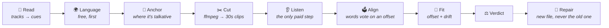

<div align="center">

# 💬 Cicerone

**A Jellyfin plugin that listens to your films —<br/>and tells you whether the subtitles are actually saying what they say.**

[](https://jellyfin.org)
[](https://dotnet.microsoft.com)
[](#-installation)

*The right language · the right cut · timed to the dialogue*

</div>

---

Cicerone is a scheduled task. For every item it cuts a few seconds of real audio out of the file at several points, has a speech-to-text model say what is in each clip, and measures the gap between when a word was **heard** and when the subtitle claims it was **said**.

It answers the question nothing else in a media server asks: not *are there subtitles*, but *are these the right ones, and are they in time*.

> **Status:** written against Jellyfin 10.11.11. Everything described here is built and the pure logic is covered by tests, but **the plugin has not yet been run against a live server** — see [Status](#%EF%B8%8F-status) before installing.

## 🎯 Scope

Cicerone does exactly one thing: **grade and repair the subtitles you already have.**

It does not download them. [Bazarr](https://www.bazarr.media/) and the Open Subtitles plugin fetch; this is what tells you whether what they fetched is any good. It is also not a rules engine — [SmartLists](https://github.com/jyourstone/jellyfin-smartlists-plugin) is that — and it never edits a file you already had.

## 🧠 How it works



**1. Read.** Every subtitle track in a language you asked for, pulled as SRT through Jellyfin's own `ISubtitleEncoder` — which converts ASS, mov_text, WebVTT and external files on the way out, so Cicerone parses exactly one format. Annotations, speaker names, `[door creaks]` and the ripper's signature are stripped, because a transcript will never contain any of them and a hearing-impaired track would otherwise score worse than a clean one against identical audio.

**2. Language.** Read from the track's own text, before a byte of audio is fetched. Script decides where it can — text in Hangul is Korean and no word list is going to argue — and within the Latin and Cyrillic alphabets the signal is function words: *the*, *und*, *que*, *ale*. They are the most frequent words in any language and almost never shared across two.

This is the cheapest useful thing here and it runs first for a reason. **A track tagged English and written in Spanish is a common and completely invisible fault** — the player shows the language you picked, the words are wrong, and no amount of sync checking explains it. Asking a model would cost a call per track to answer the one question in the plugin that a few hundred bytes of table answers exactly.

**3. Anchor.** Five windows of thirty seconds, spread through the runtime, placed where the subtitles say the film is talkative. Never the first 5% or the last 8% — distributor logos and a cold open at one end, a credit crawl at the other, and the head is also where a ripper's signature sits.

**Cost here is bounded by the anchors, not the runtime.** Five thirty-second windows is two and a half minutes of audio whether the item is a twenty-minute episode or a three-hour film. Transcribing whole files is the obvious approach and forty times the bill, and it buys nothing: the question is only *where does this track sit*, and a few seconds of speech answers it.

**4. Cut.** ffmpeg — the server's own, at below-normal priority — resamples each window to 16 kHz mono, which is what speech models are trained on and what they would resample to anyway.

> **The seek is the load-bearing part.** Cicerone's whole output is a difference between two clocks, and the audio clock is defined by where ffmpeg actually started reading. A seek that quietly lands on the nearest keyframe two seconds early does not produce a *worse* measurement — it produces a **confident** one that is two seconds wrong, in the same direction, at every anchor, which fits a perfectly straight line and reads as a real constant offset. Nothing downstream can catch that. So the coarse container seek is done two seconds early and those two seconds are then decoded and discarded, which is exact and still takes milliseconds.

**5. Listen.** The clip goes to a speech-to-text model and comes back as timed segments. This is the only step that spends anything and the only one that touches the network.

**Which audio track matters.** A release carrying a German dub as its default, checked against an English subtitle file, shares almost no words with it — so every anchor returns votes and no agreement, and a perfectly good file is reported as a different cut. Cicerone picks the audio track in the subtitle's own language, then the default, then the one with the most channels, because a stereo commentary beside a 5.1 feature mix is words spoken *over* the film rather than in it.

**6. Align.** **This is a vote, not a search.** Every word appearing on both sides proposes one offset — the gap between where the subtitle puts it and where it was heard — and the offsets are histogrammed. The true shift is the only value hundreds of unrelated words can agree on by anything other than chance, so it stands up as a spike while wrong pairings smear out flat.

Words occurring more than six times on either side are dropped outright. That is the stopword list, derived from the text in front of it rather than from a table — *the* and *you* carry no positional information, and every one of their hundreds of pairings is a guess. Deriving it works in Polish and Japanese too, which an English stopword list does not.

It also degrades in the right direction: a garbled transcript, a silent window, or a subtitle file for another film all produce many votes and no agreement, which reads as low confidence rather than as a confident wrong answer.

**7. Fit.** A straight line through the anchors, weighted by confidence, giving a constant offset **and a drift**. The residual is reported alongside, because it is the fit's own account of whether a line was the right thing to fit at all.

**8. Verdict.** In sync, out by a constant, drifting, the wrong language, or not this dialogue at all.

## 🎞 Why one measurement is worse than none

The most common way a subtitle file is wrong is not an offset. It is a **frame rate mismatch**: a file timed against a 25 fps PAL transfer, played over a 23.976 fps source. It drifts at one part in twenty-four — dead on at one moment, four minutes adrift a couple of hours later.

Anyone who has nudged a subtitle offset until the opening scene matched, and found it broken again an hour into the film, has met this.

Now consider what a checker that measures sync **at one point** reports about such a file. It picks a moment, measures, and finds the subtitles perfect — because at that moment they *are* perfect. It tells you the file is fine. You believe it, because you asked and it checked.

That is worse than not checking at all.

```
        error
          │
    +25s ─┤ ●
          │   ●
      0s ─┼─────●───────────────────  ← the one place a single check might look
          │       ●
    −25s ─┤         ●
          │           ●
   −200s ─┤             ● ● ● ● ● ● ●
          └──────────────────────────
          0                    runtime
```

Two anchors is the minimum that can see a slope at all. Five is what makes the answer survive one of them landing in a silence, a music cue, or a stretch the transcriber could not read. That is the whole premise of the plugin, and it is why `AnchorCount` is a setting with a floor rather than a dial you can turn to one.

**Naming the ratio matters too.** A fitted drift of 1.04270 is a measurement with error in it; 25/23.976 is exact. When the fit lands within a whisker of a known frame rate pair, Cicerone snaps to the ratio — which makes a repair correct across the whole runtime instead of accumulating the fit's own residual over three hours, and lets the report say *25 → 23.976 fps, so the file was timed against a different transfer* rather than printing a slope at you.

The tolerance is tight enough to tell 24 from 23.976, which differ by one part in a thousand and two and a half seconds across a feature.

## 🌍 Choosing a language

**Languages you want, best first** is the setting the whole plugin is arranged around. It decides which tracks are worth spending audio on, which audio track each one is checked against, and which language an item is reported as *missing*.

Leave it empty and every track gets checked, which on a disc rip with sixteen language tracks is sixteen times the bill for fifteen answers nobody wanted.

Where an item has several tracks in one language, Cicerone ranks them and the report shows the winner:

| Rank by | Then | Reason |
|---|---|---|
| **Verdict** | In sync → offset → drifting → unknown → mismatched | The whole point of having checked is that a verified track should win |
| **Cue count** | More is better | A fuller track over a partial one |
| **Not hearing-impaired** | Clean before SDH | Annotations are not dialogue |
| **Embedded** | Before external | See below |

That last row inverts what a plugin merely *reading* subtitles would do. An embedded track was timed against the encode it ships inside; an external file was timed against whatever release its author happened to have — **which is the single largest source of the desync this plugin exists to find.**

## ⚙️ The model

Cicerone keeps a list of transcription profiles rather than one set of credentials. A profile is everything needed to call one backend — provider, model, its own key, an optional base URL, and its own price.

| Provider | Notes |
|---|---|
| **OpenAI** | `whisper-1`. See below for why not the newer ones |
| **OpenAI-compatible** | Anything speaking the same endpoint at a base URL you supply — Speaches, faster-whisper-server, whisper.cpp's server, LM Studio, Groq. **A local one makes the whole plugin free and sends no audio anywhere** |
| **Google** | Gemini takes audio as an ordinary part of a prompt, and the response schema makes the shape an API guarantee rather than something the prompt asks for |

> **Cicerone needs a *timed* transcript, not a good one.** The entire output is a comparison between when a word was said and when the subtitle claims it was, so timings are the product and the prose is incidental.
>
> That rules out more models than it sounds like it should. Segment timings come back only in OpenAI's `verbose_json` response format, and **`gpt-4o-transcribe` and its mini do not support that format at all** — they return an excellent transcript with no times in it and are useless here. The old, cheap `whisper-1` is the correct choice, which is a pleasant place to end up.
>
> A transcript that arrives untimed is still kept: its words are spread evenly across the clip, its confidence is halved, and the report says the timings were estimated rather than heard. Spread like that it can still prove a track is a minute late; it can never resolve the third of a second that separates *in sync* from *not*.

Prices are per **minute of audio** rather than per token, because minutes are the unit Cicerone actually controls. The anchor count and window length decide the bill exactly, before a single call is made — which is why **Work it out** on the Run tab quotes a whole library in advance rather than explaining it afterwards.

## 🔧 Repairs

**Cicerone never edits a subtitle file.** A correction is a measurement, measurements have error, and the failure mode of editing in place is destroying a file somebody spent an evening timing by hand.

A repair is always a new file beside the original:

```
Film (2019).mkv
Film (2019).en.srt              ← yours, untouched
Film (2019).en.cicerone.srt     ← the corrected copy
```

Jellyfin reads the language out of that name and offers it as a selectable track. The `cicerone` marker is what makes the plugin's own output identifiable — **nothing here will ever overwrite a file it did not write** — and it is never allowed to be empty. A hearing-impaired source keeps its `sdh` flag, or a repaired SDH track would appear as a second, mysteriously duplicated language in the viewer's menu.

Only the timings change. Cues are rewritten from the original text, so italics, annotations and speaker names come through a repair byte-identical. The file is written to a temporary name and moved into place, because a run *will* be interrupted — installing any plugin tears Jellyfin's host down in process — and half a subtitle file is something a player will happily load and then truncate the film at.

| Setting | Description |
|---|---|
| **When a track is out of sync** | Report only *(default)*, write a corrected copy, or write it and rescan so Jellyfin picks it up. Look at what a first run finds before letting it write anything — a library where everything reads as mismatched usually means a misconfigured transcriber, not two hundred broken files |
| **Only repair beyond** | 0.6s, deliberately above the in-sync tolerance. Between the two sits a band where rewriting would move the timings by less than the measurement's own error, which is not a repair — it is a coin toss that leaves a second file in the folder |
| **Only repair above confidence** | Averaged over the windows that actually matched, and at least two of them. A window that produced nothing is silence rather than disagreement, and letting it drag the average down would block repairs on quiet films |
| **Write beside the media** | The only place Jellyfin will pick a subtitle up from. Read-only folders fall back to the plugin's data directory and the report says so, because a repair nothing can see is not the same as a repair |

Clearing the stored reports does **not** delete repaired files. Those are files in your library folders, and removing them is a decision to make with a file manager rather than a side effect of clearing a cache.

## 📊 The report

**Cicerone → Report** tallies what has been found, counted on the **best** track per language rather than on every track — that is the one a viewer will actually be shown. An item holding one perfect English track and three broken ones is covered; tallying all four would report it as a quarter working.

| Verdict | What it means | Repairable |
|---|---|---|
| **In sync** | Matches the dialogue and holds its timing throughout | — |
| **Out by a constant** | The whole track is shifted, evenly | Yes |
| **Drifting** | Runs at the wrong speed: right in one place, wrong in another | Yes |
| **Not this dialogue** | The windows each measured something real and lie on no single line — a different cut, the wrong file, or audio the transcriber could not read | No |
| **Wrong language** | The text is confidently not the language the track claims | No |
| **Nothing to check** | Forced, image-only, or no dialogue once annotations came off | No |
| **Undecided** | Nothing was listened to, or nothing came back | No |

The number worth watching is **worst error**, not the offset. A drifting track has an offset near zero and is unwatchable by the end; reporting the offset would say it is fine.

Language beats sync in the ordering, because a Spanish file tagged English is not a sync problem and reporting it as one sends you off to fix the wrong thing. It is also the one verdict reached without spending anything.

Reports are keyed on the media file's size and modification time, so a second run over an unchanged library is free and a replaced release is re-checked without anybody having to remember that it was replaced.

## 📦 Installation

### Prerequisites

1. A Jellyfin **10.11.x** server.
2. **ffmpeg**, which Jellyfin already ships and configures — Cicerone uses the server's own path, so if playback works, this does too.
3. A speech-to-text endpoint: an OpenAI key, a Google key, **or** a local Whisper server, which costs nothing and sends no audio off your network.

### Install from the plugin catalogue

1. In Jellyfin, go to **Dashboard → Plugins → Repositories** and add:

   ```
   https://raw.githubusercontent.com/nitramivel/jellyfin-cicerone/main/manifest.json
   ```

2. Switch to the **Catalog** tab — Cicerone appears under General. Click it and press **Install**.
3. Restart Jellyfin when prompted.
4. Open Cicerone's configuration page. On the **Models** tab add a profile and press **Test the default profile** — it sends half a second of silence, which costs nothing and answers the question the page otherwise cannot: without it, a wrong key, a local server that is not running, and a library with nothing to check all look identical.
5. On **Languages**, set the languages you actually want.
6. On **Run**, press **Work it out** to see what a full run would cost, then **Try one item** with a single item ID before turning it loose.

The **Verify Subtitles** scheduled task ships with **no default schedule**. Every other task in this family runs weekly out of the box; this one does not, because it is the only one that spends money the first time it fires. Set a schedule under **Dashboard → Scheduled Tasks** once the bill is a known quantity.

### Install manually (folder drop)

1. Grab a packaged build from [releases](https://github.com/nitramivel/jellyfin-cicerone/releases), or build one yourself. Either way you end up with a folder containing `Jellyfin.Plugin.Cicerone.dll` and `meta.json`.
2. Copy it into your server's plugin directory as `plugins/Cicerone_<version>`:

   | Setup | Plugin directory |
   |---|---|
   | Podman/Docker (config dir mounted at `/config`) | `<your config mount>/plugins/Cicerone_0.1.0.0/` |
   | Linux package | `/var/lib/jellyfin/plugins/Cicerone_0.1.0.0/` |
   | Windows | `%ProgramData%\Jellyfin\Server\plugins\Cicerone_0.1.0.0\` |

3. Make sure the files are readable by the Jellyfin user (for containers, match the UID the container runs as).
4. Restart Jellyfin, then configure as above.

### Building from source

Requires the .NET 9 SDK.

```bash
git clone https://github.com/nitramivel/jellyfin-cicerone
cd jellyfin-cicerone
dotnet test Jellyfin.Plugin.Cicerone.sln -c Release   # no network, no ffmpeg needed
./build/package.sh                                    # artifacts/Cicerone_<version>/
```

`build/package.sh` accepts `VERSION` and `TARGET_ABI`. Releasing a catalogue version is `VERSION=x.y.z.w CHANGELOG="..." ./build/release.sh`, which builds the zip, computes its checksum and updates `manifest.json` — then upload that exact zip to a GitHub release tagged `vx.y.z.w`.

## 🔌 API

Every endpoint is admin-only. Unlike a plugin that draws something on a detail page, nothing here is read by a viewer's browser.

| Endpoint | Purpose |
|---|---|
| `GET /Cicerone/Version` | The running plugin version |
| `GET /Cicerone/Status` | The live run, with progress, spend and time left |
| `GET /Cicerone/Estimate` | What a full run would cost, before spending anything |
| `POST /Cicerone/Verify` | Queue a full run |
| `POST /Cicerone/Verify/{itemId}` | Check one item now and return what was found |
| `POST /Cicerone/TestProfile` | Send half a second of silence and report whether the transcriber answered |
| `GET /Cicerone/Reports` | The coverage tally and every item, optionally filtered by verdict |
| `GET /Cicerone/Report/{itemId}` | One item's report |
| `DELETE /Cicerone/Reports` | Forget every stored report. Does not touch repaired files |
| `GET /Cicerone/Runs?limit=5` | Recent runs, newest first |
| `GET /Cicerone/Runs/{runId}` | One run in full, every item it touched |

## ⚠️ Status

Version `0.x`, deliberately.

Everything on this page is built, and the parts that can be decided without a server are covered by tests — the SRT parsing, the cleaning, the anchor planning, the offset vote, the drift fit, the frame rate ratios, the verdicts, the retiming, the language identification, the ffmpeg command lines and the provider response parsing are all exercised against synthetic dialogue with a known answer.

**What has not happened is a run against a real server.** The plugin has never been compiled against `Jellyfin.Controller`, because the machine it was written on has no .NET SDK, no ffmpeg and no Jellyfin. Claims here about *accuracy* are designed-for rather than measured; claims about *cost* are arithmetic and exact.

`CLAUDE.md` lists what is left, including the handful of Jellyfin API calls written from the patterns in the sibling plugins and not yet verified against the real assembly.

## ⚠️ Caveats

- **Anchors are planned from cue density**, which is a proxy for where the film is talkative. It holds under an offset because talkative stretches are minutes long rather than seconds — but a badly desynced file degrades it, and a window that lands in silence produces nothing. That is why there are five and not one.
- **An untimed transcript cannot resolve sub-second sync.** If your backend does not return segment timings, Cicerone will still catch a gross offset and will tell you it is guessing.
- **A dub-only release cannot verify a subtitle in the original language.** There is no audio in that language to compare against, and the honest answer is a mismatch.
- **Image subtitles are skipped.** Reading PGS or VobSub needs OCR, which is a dependency, a GPU and an error rate that would land directly in the sync measurement.
- **Forced tracks are skipped.** A forced track carries a few dozen lines for a whole film, and checking one looks exactly like success right up to the point where the verdict means nothing.
- **The model can mishear.** It gets thirty seconds of a mix built for a cinema, not a podcast. The vote is designed so that mishearing costs confidence rather than producing a wrong answer, but a difficult film is a film with fewer usable anchors.
- **Installing any plugin restarts Jellyfin's host in-process.** A run started beforehand is abandoned part-way. Cicerone reports that as what it is, and each item is written as it completes so nothing already paid for is lost — but don't start a run and then install a plugin.

## 🧭 The name

A cicerone is a guide who conducts visitors and explains what they are looking at. The job is not to speak for the thing — it is to make sure what you are being told matches what is in front of you.

## 🙏 Siblings

[Curator](https://github.com/nitramivel/jellyfin-curator) asks an LLM what your library has in common. [Concierge](https://github.com/nitramivel/jellyfin-concierge) finds things from a description rather than a title. [Colorist](https://github.com/nitramivel/jellyfin-colorist) samples the colour of every film and draws it across the detail page.

Cicerone shares Concierge's approach to subtitles — one format, read through the server's own encoder, cleaned before it is trusted — and the model-profile pattern from both of the others.

## 📄 Licence

MIT.
